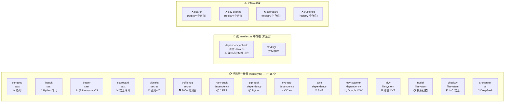
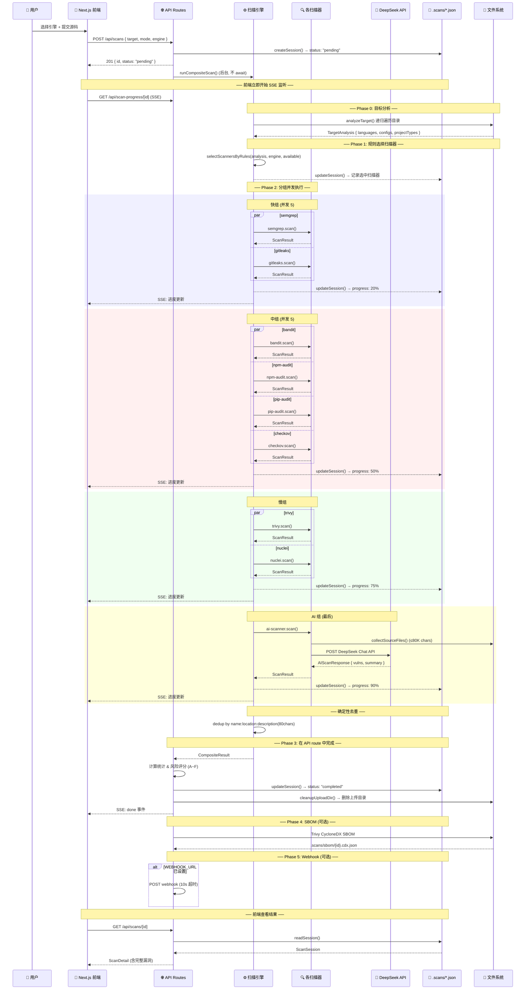

# VulnGuard 系统运行流程图

> 基于实际代码 (`src/lib/scanner/composite.ts`, `registry.ts`, `target-analyzer.ts`, `scan-store.ts`, `reachability.ts`, `manifest.ts`) 生成
> 
> 生成时间: 2026-06-11 | 对照: `SYSTEM_ARCHITECTURE.md` v1.0

---

## 总览流程图

```mermaid
flowchart TB
    %% ===== 用户操作层 =====
    subgraph User["👤 用户操作层"]
        A1["选择引擎模式<br/>(ai / all)"]
        A2["提交扫描目标<br/>(源码目录路径)"]
    end

    %% ===== API 层 =====
    subgraph API["🌐 API 层 (Next.js API Routes)"]
        B1["POST /api/scans<br/>{ target, mode, engine }"]
        B2["createSession()<br/>写入 .scans/{id}.json"]
        B3["返回 { id, status: 'pending' }<br/>立即响应，不等待扫描"]
        B4["runCompositeScan()<br/>后台异步执行"]
    end

    %% ===== Phase 0 =====
    subgraph P0["🔍 Phase 0 — 目标分析"]
        C1["analyzeTarget(targetPath)"]
        C2["递归遍历目录<br/>跳过 node_modules, .git, dist 等"]
        C3["按扩展名统计语言分布<br/>javascript: 119 文件 (38%)..."]
        C4["检测 20+ 种配置文件<br/>package.json, Dockerfile, go.mod..."]
        C5["推断项目类型<br/>javascript/typescript, python..."]
        C6["输出 TargetAnalysis<br/>totalFiles, languages, configFiles,<br/>projectTypes, sizeCategory,<br/>hasIaC, hasPython, fileTreeSample"]
    end

    %% ===== Phase 1 =====
    subgraph P1["⚙️ Phase 1 — 规则选择扫描器"]
        D1["selectScannersByRules()<br/>⚠️ 硬编码规则，非 AI 决策"]
        D2{"engine 模式?"}
        D3["ai 模式<br/>按规则精选"]
        D4["all 模式<br/>所有可用扫描器全上"]

        subgraph Rules["📋 规则匹配表"]
            R1["✅ 总是选中:<br/>semgrep, gitleaks, trivy,<br/>ai-scanner (最后)"]
            R2["🐍 Python 检测到:<br/>bandit, pip-audit"]
            R3["📦 JS/TS 检测到:<br/>npm-audit"]
            R4["🐳 Docker/TF 检测到:<br/>checkov"]
            R5["☕ Java/Gradle 检测到:<br/>dependency-check ⚠️"]
            R6["🔵 Go 检测到:<br/>dependency-check ⚠️"]
            R7["🦀 Rust 检测到:<br/>dependency-check ⚠️"]
            R8["⚡ C/C++ 检测到:<br/>cve-cpp"]
            R9["🍎 Swift 检测到:<br/>swift"]
            R10["🔷 .NET 检测到:<br/>dependency-check ⚠️"]
            R11["📁 文件 > 20 个:<br/>nuclei"]
            R12["❌ AI 模式不自动选中:<br/>trufflehog, bearer,<br/>scorecard, osv-scanner<br/>(仅 all 模式生效)"]
        end

        D5["按可用性过滤<br/>availableNames.includes(name)"]
        D6["⚠️ dependency-check 不在 registry<br/>中 → 被过滤掉，实际永不生效"]
    end

    %% ===== Phase 2 =====
    subgraph P2["🚀 Phase 2 — 并发执行"]
        E1["buildParallelGroups()"]
        E2["快组 (secret + semgrep)<br/>semgrep, gitleaks,<br/>trufflehog¹, scorecard¹<br/>¹ 仅 all 模式"]
        E3["中组 (dependency + sast)<br/>bandit, npm-audit, pip-audit,<br/>checkov, cve-cpp, swift,<br/>osv-scanner¹, bearer¹<br/>¹ 仅 all 模式"]
        E4["慢组 (filesystem)<br/>trivy, nuclei"]
        E5["AI 组 (最后)<br/>ai-scanner"]

        subgraph Exec["执行引擎"]
            EX1["组间串行<br/>快组 → 中组 → 慢组 → AI 组"]
            EX2["组内并发<br/>滑动窗口，最多 5 个同时运行"]
            EX3["单个失败不影响其他<br/>catch → errors[]"]
            EX4["每完成一个 →<br/>updateSession() → SSE 推送"]
        end
    end

    %% ===== 去重 =====
    subgraph Dedup["🧹 确定性去重"]
        F1["按 key 去重<br/>name:location:description(80chars)"]
        F2["⚠️ 无 AI 聚合分析<br/>(ai-aggregator.ts 不存在)"]
        F3["⚠️ 可达性分析未集成<br/>(reachability.ts 存在但不调用)"]
    end

    %% ===== Phase 3 =====
    subgraph P3["✅ Phase 3 — 完成 (在 API route 中)"]
        G1["统计严重等级<br/>Critical / High / Medium / Low"]
        G2["计算风险评分 A~F"]
        G3["写入 session<br/>status → 'completed'"]
        G4["cleanupUploadDir()<br/>删除上传的源码目录"]
    end

    %% ===== Phase 4 =====
    subgraph P4["📦 Phase 4 — SBOM 生成 (可选)"]
        H1["用 Trivy 生成 CycloneDX SBOM"]
        H2[".scans/sbom/{id}.cdx.json"]
    end

    %% ===== Phase 5 =====
    subgraph P5["🔔 Phase 5 — Webhook 通知 (可选)"]
        I1["判断 WEBHOOK_URL 是否设置"]
        I2["POST JSON 到外部地址<br/>含 scanId, summary, scanners 信息"]
        I3["超时 10s，失败不阻塞"]
    end

    %% ===== 前端实时 =====
    subgraph Frontend["📊 前端实时推送"]
        J1["GET /api/scan-progress/[id]<br/>SSE (Server-Sent Events)"]
        J2["服务端 500ms 轮询 scan-store"]
        J3["进度有变化 → 推送 data 事件"]
        J4["扫描完成 → 推送 done 事件后关闭"]
        J5["客户端断开 → 清理 interval"]
    end

    %% ===== 存储层 =====
    subgraph Storage["💾 存储层"]
        K1[".scans/{id}.json<br/>全量扫描会话数据"]
        K2[".scans/sbom/{id}.cdx.json<br/>CycloneDX SBOM"]
        K3["data/uploads/<br/>上传的源码 (扫描后自动清理)"]
    end

    %% ===== AI 扫描器 =====
    subgraph AI["🤖 AI 扫描器 (ai-scanner)"]
        L1["收集源码文件<br/>最多 80,000 字符"]
        L2["调用 DeepSeek Chat API<br/>model: deepseek-v4-flash"]
        L3["AI 分析: 业务逻辑漏洞<br/>跨文件复合漏洞<br/>权限缺陷<br/>架构问题"]
        L4["输出 AIScanResponse<br/>vulnerabilities[] +<br/>analysis_summary"]
        L5["⚠️ 跳过 DEEPSEEK_API_KEY<br/>未设置时自动跳过"]
    end

    %% ===== 连接 =====
    A1 --> A2 --> B1
    B1 --> B2 --> B3
    B2 --> B4

    B4 --> P0
    C1 --> C2 --> C3 --> C4 --> C5 --> C6

    C6 --> P1
    D1 --> D2
    D2 -->|"ai"| D3
    D2 -->|"all"| D4
    D3 --> Rules
    D4 --> Rules
    Rules --> D5 --> D6

    D6 --> P2
    E1 --> E2 --> E3 --> E4 --> E5
    E2 --> Exec
    E3 --> Exec
    E4 --> Exec
    E5 --> Exec

    Exec --> Dedup
    F1 --> F2
    F2 --> F3

    F3 --> P3
    G1 --> G2 --> G3 --> G4

    G4 --> P4
    H1 --> H2

    H2 --> P5
    I1 --> I2 --> I3

    B2 -.->|"⚡ SSE"| J1
    Exec -.->|"每完成一个更新"| J2
    J2 --> J3 --> J4

    B3 -.->|"前端获取详情"| K1
    G3 --> K1
    G4 --> K3
    H2 --> K2

    %% ===== AI 组展开 =====
    E5 -.-> AI
    L1 --> L2 --> L3 --> L4
    L2 -.-> L5

    %% ===== 风险评分 =====
    subgraph Score["📊 风险评分公式"]
        S1["Critical > 0 → F"]
        S2["High > 2 → D"]
        S3["High > 0 → C"]
        S4["Medium > 3 → B"]
        S5["其他 → A"]
    end
    G2 --> Score

    %% ===== 图例 =====
    subgraph Legend["📖 图例"]
        Lg1["🟢 正常运行流程"]
        Lg2["⚠️ 文档疏漏 / 实际不存在"]
        Lg3["❌ 代码中存在但未在文档中提及"]
        Lg4["-.-.> 间接连接 / 参考关系"]
    end
```



---

## 扫描器注册表全貌



---

## 数据流时序图



---

## ⚠️ 文档疏漏清单 (SYSTEM_ARCHITECTURE.md vs 实际代码)

### 🔴 严重不一致

| #   | 问题                        | 文档记载                             | 实际代码                                                                                        | 影响                                   |
| --- | ------------------------- | -------------------------------- | ------------------------------------------------------------------------------------------- | ------------------------------------ |
| 1   | **AI Orchestrator 不存在**   | 文档第3节描述 DeepSeek 驱动的扫描器选择        | `composite.ts:48-133` 使用硬编码 `selectScannersByRules()`                                       | 文中多处"AI 决策"描述不实                      |
| 2   | **AI Aggregator 不存在**     | 文档 4.1 场景二、CLAUDE.md 都提到 AI 聚合分析 | `ai-aggregator.ts` 文件不存在                                                                    | 实际只有确定性去重                            |
| 3   | **dependency-check 状态错误** | 文档列为"暂时移除"                       | `registry.ts` 中完全不存在，但 `selectScannersByRules()` 仍会尝试选中它然后被 `availableNames.includes()` 过滤掉 | 规则引擎中 Java/Go/Rust/.NET 的扫描器选择实际永不生效 |

### 🟡 遗漏

| #   | 问题                      | 说明                                                                      |
| --- | ----------------------- | ----------------------------------------------------------------------- |
| 4   | **Bearer 扫描器未提及**       | `registry.ts` 注册了 `bearer` (sast, 仅 Linux/macOS)，完全不在扫描器清单中             |
| 5   | **OSV-Scanner 被忽略**     | 已注册且实现完成，但文档未列入扫描器清单                                                    |
| 6   | **Scorecard 被忽略**       | 已注册且实现完成，但文档未列入扫描器清单                                                    |
| 7   | **TruffleHog 被列为仅全量模式** | 文档说是，但 `selectScannersByRules()` 根本没写 trufflehog 的规则；所以它实际只在 all 模式下被选中 |
| 8   | **manifest.ts 存在但未使用**  | 文档未提及，CLAUDE.md 说它驱动 orchestrator 决策，实际代码无引用                            |
| 9   | **reachability.ts 未集成** | 文件存在、功能完整，但 `composite.ts` 中从未调用                                        |

### 🟢 准确（确认正确的）

| #   | 项目                   | 核实                                              |
| --- | -------------------- | ----------------------------------------------- |
| ✅   | SSE 实时推送             | `scan-progress/[id]/route.ts` 正确实现, 500ms 服务端轮询 |
| ✅   | 规则驱动的扫描器选择           | `selectScannersByRules()` 逻辑与文档基本一致             |
| ✅   | 分组并发执行               | `buildParallelGroups()` + 滑动窗口 5 并发             |
| ✅   | 进度更新机制               | `updateSession()` → SSE 推送                      |
| ✅   | upload 自动清理          | `cleanupUploadDir()` 在 API route 中调用            |
| ✅   | SBOM 生成              | 用 Trivy 在 Phase 4 生成 CycloneDX                  |
| ✅   | Webhook 通知           | Phase 5 异步 POST                                 |
| ✅   | 风险评分                 | A~F 公式与文档一致                                     |
| ✅   | target-analyzer 跳过目录 | 20+ 种跳过，与文档一致                                   |

---

## 修订建议

### 1. 更新扫描器清单

在文档第5节中补充：

```diff
+ | 12 | OSV-Scanner | SCA | Google OSV.dev 数据库 | `osv-scanner.exe` 存在 |
+ | 13 | OpenSSF Scorecard | SAST | 10+ 维安全实践评分 | `scorecard.exe` 存在 |
+ | 14 | AI Scanner | AI | DeepSeek LLM 代码审计 | `DEEPSEEK_API_KEY` 存在 |
+ | 15 | Bearer | SAST | 仅 Linux/macOS | `process.platform !== "win32"` |
```

### 2. 删除 AI Orchestrator / Aggregator 相关描述

`src/lib/scanner/orchestrator.ts` 和 `src/lib/scanner/ai-aggregator.ts` 不存在的，文档中所有提及应改为"**规则驱动选择 + 确定性去重**"。

### 3. 修正 Phase 3 位置

风险评分计算在 API route handler (`src/app/api/scans/route.ts:33-38`) 中，不在 `composite.ts` 内。

### 4. 添加 reachability.ts 集成说明

`reachability.ts` 功能完整但未接入主流程，应在扫描结果处理中调用 `analyzeReachability()` 将不可达依赖的 CVE 标记为低优先级。
